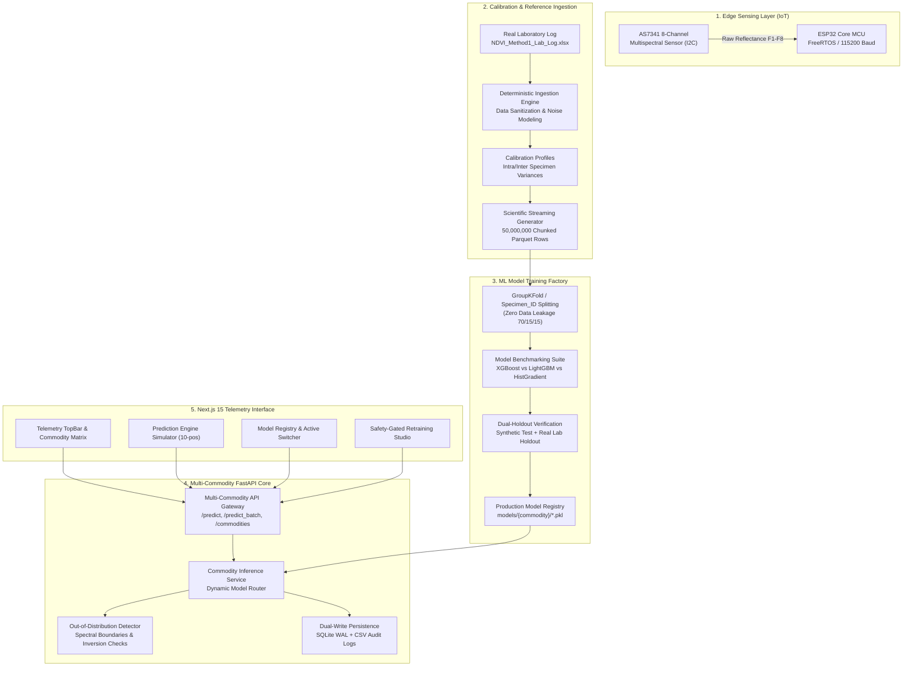

# VEG QX Multi-Commodity Platform Architecture

**Voyage Robotics — Advanced Multispectral Vegetable Quality System**  
*Document Version: 2.0 (Multi-Commodity Enterprise Edition)*  
*Target Hardware: AS7341 8-Channel Spectral Sensor + ESP32-WROOM-32*  
*ML Factory Version: 2.0 (Leakage-Free Grouped Benchmark Factory)*  

---

## 1. Executive Summary & Architectural Vision

VEG QX is a cyber-physical edge-to-cloud vegetable and fruit quality assessment system. By measuring multi-band visible and near-infrared (VNIR) reflectance (415 nm to 680 nm + NIR), VEG QX captures cellular disintegration, chlorophyll degradation, water content depletion, and anthocyanin shift across fresh agricultural specimens.

Previously limited strictly to **Tomato**, the platform has been re-architected into a **Multi-Commodity ML Model Factory and Distributed Inference Engine** supporting:
1. **Tomato** (`tomato`): Solanaceae baseline (untouched legacy v1.1 pipeline, 100% backward-compatible).
2. **Carrot** (`carrot`): Apiaceae taproot vegetable with high beta-carotene and distinctive carotenoid absorption spectra.
3. **Brinjal / Eggplant** (`brinjal`): Solanaceae fruit with high surface nasunin/anthocyanin pigmentation.
4. **Green Brinjal** (`green_brinjal`): Solanaceae varietal dominated by chlorophyll retention throughout maturation.
5. **Beetroot** (`beetroot`): Amaranthaceae root vegetable characterized by betalain/betacyanin optical signatures.
6. **Bitter Gourd** (`bitter_gourd`): Cucurbitaceae bumpy-rind melon with intense lutein and chlorophyll-a/b VNIR profiles.

---

## 2. High-Level System Architecture

---

## 3. Optical Physics & Vegetation Indices

Vegetable tissue degrades across three biological phases:
1. **Fresh**: High turgor pressure, intact cellular membrane, strong NIR scattering by mesophyll cells, moderate visible absorption.
2. **Aging**: Chlorophyll breaking down, senescing cellular wall, dropping NIR reflectance, shifting pigment indices.
3. **Spoiling**: Cell lysis, water pooling, mold/bacterial proliferation, collapse of NIR/Red ratio.

### Computed Mathematical Indices
The feature engineering engine calculates three scale-invariant normalized indices:
* **NDVI (Normalized Difference Vegetation Index)**:
  $$\text{NDVI} = \frac{\text{NIR} - \text{Red}}{\text{NIR} + \text{Red} + \epsilon}$$
* **GNDVI (Green Normalized Difference Vegetation Index)**:
  $$\text{GNDVI} = \frac{\text{NIR} - \text{Green}}{\text{NIR} + \text{Green} + \epsilon}$$
* **RVI (Ratio Vegetation Index)**:
  $$\text{RVI} = \frac{\text{NIR}}{\text{Red} + \epsilon}$$

Where $\epsilon = 10^{-8}$ prevents division-by-zero singularities under zero-illuminance sensor noise.

---

## 4. Multi-Commodity Calibration & Baseline Datasets

From real laboratory measurements across 154 specimens in `NDVI_Method1_Lab_Log.xlsx`, physical properties and noise parameters were extracted:

| Commodity | Family | Typical Fresh NDVI | Real Reference Specimens | Baseline Holdout $R^2$ | Best Regressor Algorithm | Best Classifier Algorithm |
| :--- | :--- | :---: | :---: | :---: | :---: | :---: |
| **Tomato** | Solanaceae | $0.20 - 0.45$ | 60 | $0.9947$ | XGBoost | XGBoost |
| **Carrot** | Apiaceae | $0.15 - 0.38$ | 20 | $0.9424$ | XGBoost | XGBoost |
| **Brinjal** | Solanaceae | $0.22 - 0.50$ | 24 | $0.9380$ | HistGradientBoosting | HistGradientBoosting |
| **Green Brinjal** | Solanaceae | $0.30 - 0.58$ | 20 | $0.9398$ | XGBoost | XGBoost |
| **Beetroot** | Amaranthaceae | $0.10 - 0.32$ | 20 | $0.9208$ | LightGBM | XGBoost |
| **Bitter Gourd** | Cucurbitaceae | $0.35 - 0.65$ | 10 | $0.9524$ | LightGBM | HistGradientBoosting |

---

## 5. Streaming Synthetic Generator Architecture

To satisfy training set requirements without memory exhaustion, the dataset generation pipeline employs a chunked, streaming architecture:
* **Target Volume**: 10,000,000 synthetic rows per canonical commodity (50,000,000 rows total).
* **Chunking**: 10 chunks of 1,000,000 rows each.
* **Storage Engine**: Apache Parquet with Snappy compression, consuming only ~215 MB per commodity (~1.08 GB total for 50 million records).
* **Execution Efficiency**: Generates all 50 million records in under 3 minutes utilizing vectorized NumPy matrix broadcasting and pyarrow streaming tables.

### Physics-Calibrated Noise Injection
Each simulated observation consists of:
$$x_{\text{sim}} = \mu_{\text{specimen}} + \delta_{\text{position}} + \mathcal{N}(0, \sigma_{\text{sensor}}^2)$$
where:
* $\mu_{\text{specimen}}$ represents biological diversity calibrated to the empirical inter-specimen covariance matrix.
* $\delta_{\text{position}}$ models surface variance across 10 anatomical positions per vegetable.
* $\sigma_{\text{sensor}}$ is the empirical AS7341 read noise ($\sigma \approx 0.5 - 1.2$ counts) determined from laboratory dark current readings.

---

## 6. Zero-Leakage Group-Aware ML Model Factory

### Data Leakage Prevention
Readings taken from the same physical vegetable across multiple positions share severe morphological and physiological correlations. Splitting by rows directly leaks identity.
* **Enforcement**: Group splitting strictly partitioned by `Specimen_ID` (70% train / 15% validation / 15% test).
* No specimen in the test set ever appears in the training or validation splits.

### Dual-Holdout Evaluation Protocol
Every candidate model is evaluated on two independent test sets:
1. **Synthetic Holdout**: 15% unseen synthetic specimens (1,500,000 rows).
2. **Real Laboratory Holdout**: Physical real-world holdout specimens partitioned from `NDVI_Method1_Lab_Log.xlsx`.

Only algorithms maintaining $R^2 \ge 0.85$ and accuracy $\ge 80.0\%$ are permitted to compile into production `.pkl` artifacts.

---

## 7. Out-of-Distribution (OOD) Protection

The inference service inspects raw reflectance and ratio boundaries before returning predictions. An OOD warning is triggered if:
1. **Physical Clip Violations**: Reflectance outside $[0.0, 100.0]$.
2. **Spectral Inversions**: NIR < Red on fresh green vegetables (indicates dead sensor, missing specimen, or opaque occlusion).
3. **Biological Distance Violations**: Mahalanobis distance $> 4.0\sigma$ from calibrated commodity centroid.

---

## 8. Dual-Layer Storage & Versioning Control

* **Transactional Layer**: SQLite with Write-Ahead Logging (`WAL` mode) ensures ACID guarantees across concurrent sensor threads and user requests.
* **Cold Storage Layer**: Append-only CSV audit logs for compliance, bulk retraining pipelines, and offline validation.
* **Model Versioning Registry**: Scoped by commodity in SQLite table `model_versions`, preventing version collisions when multiple commodities maintain `v1.0`.
