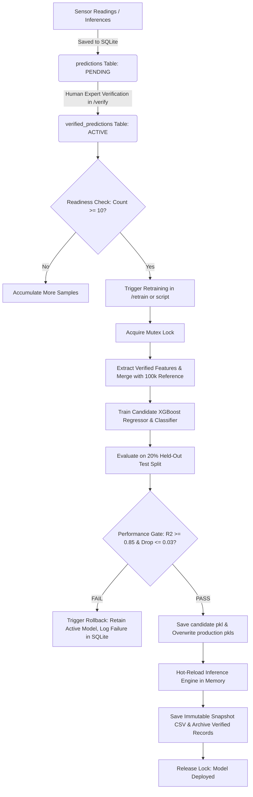

# VEG QX: Tomato Freshness Detection System — Master Project Summary & Knowledge Base

> **System Name**: VEG QX (Advanced Multispectral Vegetable Quality System)  
> **Organization**: Voyage Robotics  
> **Purpose**: This document serves as the **definitive, exhaustive technical reference** for the entire VEG QX project. It is structured so that any AI model (such as ChatGPT), software engineer, data scientist, or embedded developer can understand every single aspect of the project — including hardware, firmware, machine learning algorithms, dataset engineering, backend API, database schemas, continuous retraining workflows, frontend UI, and operational procedures.

---

## Table of Contents
1. [Project Overview & Core Mission](#1-project-overview--core-mission)
2. [High-Level System Architecture](#2-high-level-system-architecture)
3. [Repository Directory & File Structure](#3-repository-directory--file-structure)
4. [Hardware, Sensor & Firmware Layer](#4-hardware-sensor--firmware-layer)
5. [Multispectral Science & Feature Engineering](#5-multispectral-science--feature-engineering)
6. [The Sensor Noise Problem & True Threshold Ground Truth](#6-the-sensor-noise-problem--true-threshold-ground-truth)
7. [Machine Learning Pipelines & Model Zoo](#7-machine-learning-pipelines--model-zoo)
8. [Backend Architecture & API Reference (FastAPI)](#8-backend-architecture--api-reference-fastapi)
9. [Database & Persistence Layer (SQLite + CSV Sync)](#9-database--persistence-layer-sqlite--csv-sync)
10. [Continuous Retraining & Human-in-the-Loop Pipeline](#10-continuous-retraining--human-in-the-loop-pipeline)
11. [Frontend Architecture & UI Design System (Next.js 15)](#11-frontend-architecture--ui-design-system-nextjs-15)
12. [How to Run & Operational Procedures](#12-how-to-run--operational-procedures)
13. [Troubleshooting, Gotchas & Developer FAQ](#13-troubleshooting-gotchas--developer-faq)

---

## 1. Project Overview & Core Mission

### 1.1 Objective
The **VEG QX** project by **Voyage Robotics** is an industrial-grade, non-destructive optical quality inspection system designed for produce (specifically tomatoes, with a modular food-agnostic foundation for other fruits and vegetables).

Traditional freshness evaluation often relies on destructive physical testing (puncture resistance, titratable acidity, refractometry/Brix) or subjective human visual inspection. VEG QX achieves **non-destructive, instantaneous quality estimation** by shining specific wavelengths of light onto the vegetable surface and measuring multispectral reflectance using an **AS7341 11-channel spectral sensor**.

### 1.2 Dual-Task Machine Learning Output
From raw multispectral reflectance bands and computed vegetation indices, the system simultaneously predicts:
1. **Freshness Score (Regression)**: A continuous numeric score from `0.0` (completely rotten/spoiled) to `100.0` (peak harvest freshness).
2. **Freshness Category (Classification)**: One of three discrete freshness classes:
   - 🟢 **Fresh** (Freshness Score $\ge 60$)
   - 🟡 **Aging** ($40 \le \text{Freshness Score} < 60$)
   - 🔴 **Spoiling** (Freshness Score $< 40$)
3. **Class Probabilities & Confidence**: Softmax probability breakdown across the three classes (`confidence_fresh`, `confidence_aging`, `confidence_spoiling`) and overall percentage confidence.

---

## 2. High-Level System Architecture

The VEG QX system connects hardware sensors, an edge embedded controller, a Python machine learning inference server, an ACID-compliant database, and a real-time reactive web dashboard:

```
┌─────────────────────────────────────────────────────────────────────────┐
│                          HARDWARE SENSOR LAYER                          │
│  ESP32 Microcontroller + AS7341 11-Channel Spectral Sensor              │
│  • 6 Active Reflectance LEDs (Red, NIR, Blue, Green, Yellow, Orange)    │
│  • SSD1306 OLED Display (128x64) + Proximity Sensor + Push Trigger      │
│  • 10 Spatial Readings per Tomato (to capture surface variance)         │
└────────────────────────────────────┬────────────────────────────────────┘
                                     │ USB Serial (115200 baud)
                                     ▼
┌─────────────────────────────────────────────────────────────────────────┐
│                          FASTAPI BACKEND (PORT 8000)                    │
│  • PySerial USB Listener (Auto-detects / COM8 fallback)                 │
│  • WebSocket Broadcaster (/live_sensor_data, /sensor)                   │
│  • Automatic Index Calculator (NDVI, GNDVI, RVI)                        │
│  • XGBoost Inference Service (Hot-loads best model pipeline)            │
│  • Thread-Safe Continuous Retraining Service (with atomic rollback)     │
│  • SQLite DB (WAL Mode) + CSV Sync + Immutable Snapshots                │
└──────────────┬───────────────────────────────────────────▲──────────────┘
               │                                           │
    WebSocket & REST APIs                       REST Requests & UI Actions
               │                                           │
               ▼                                           │
┌──────────────────────────────────────────────────────────┴──────────────┐
│                      NEXT.JS 15 FRONTEND (PORT 3000)                    │
│  • Cyberpunk Glassmorphic Mission Control UI (Tailwind CSS + Framer)    │
│  • Target Acquisition & Reflectance Waves (TomatoScene & SpectralWaves) │
│  • Live Sensor Telemetry Console (/dashboard)                           │
│  • Manual Slider Simulator & CSV Batch Upload (/predict)                │
│  • Performance Analytics & Confusion Matrices (/analytics)              │
│  • Historical Telemetry Auditing (/history)                             │
│  • Human-in-the-Loop Ground Truth Verification (/verify)                │
│  • Model Registry & Version Switching (/models)                         │
│  • Live Continuous Retraining Hub with Progress Polling (/retrain)      │
└─────────────────────────────────────────────────────────────────────────┘
```

---

## 3. Repository Directory & File Structure

```
d:/voyage robotics VEG QX/ml model/
├── summary.md                               # THIS FILE: Definitive project knowledge base
├── README.md                                # Quick-start overview & architecture diagram
├── how_to_run.md                            # Comprehensive run instructions and prerequisites
├── CONTROL_CENTER_DOCUMENTATION.md          # Visual specification of the Mission Control landing UI
├── NDVI_System_code_New.ino                 # ESP32 C++ firmware for AS7341 + OLED + LED array
├── retrain_clean_model.py                   # Standalone script: noise removal + model retraining
├── tomato_freshness_ml_pipeline.ipynb       # 14-phase end-to-end ML research and training notebook
│
├── Tomato_Multispectral_Realistic_100k.csv  # 100k-row reference dataset (v1.0 baseline)
├── Tomato_dataset 3.csv                     # 100k-row second dataset (cleaned for v1.1/v1.2 retraining)
│
├── models/                                  # Serialized ML model artifacts (joblib .pkl)
│   ├── tomato_freshness_pipeline_v1.pkl     # v1.0 pipeline (trained on 100k reference)
│   ├── tomato_freshness_pipeline_v1.1.pkl   # v1.1 pipeline (ACTIVE: 200k cleaned data, Acc: 81.24%, R²: 0.9947)
│   ├── tomato_freshness_pipeline_v1.2.pkl   # v1.2 pipeline (retrained candidate package)
│   ├── xgboost_regressor.pkl                # Production regressor (always points to active model)
│   └── xgboost_classifier.pkl               # Production classifier (always points to active model)
│
├── datasets/                                # Runtime data storage (SQLite & CSV audit trails)
│   ├── prediction_history.db                # SQLite database (single source of truth, WAL mode)
│   ├── prediction_history.csv               # Flat CSV mirror of all inferences
│   ├── verified_dataset.csv                 # Flat CSV of human-verified samples
│   └── snapshots/                           # Immutable CSV training snapshots
│       └── training_snapshot_v1_2.csv       # Snapshot frozen at version 1.2 retraining
│
├── backend/                                 # FastAPI Python Backend (Port 8000)
│   ├── main.py                              # FastAPI entrypoint, lifespan loader, static mount, CORS
│   ├── config.py                            # Central configuration, FOOD_CONFIGS dictionary, thresholds
│   ├── requirements.txt                     # Python dependencies (fastapi, xgboost, pyserial, etc.)
│   ├── database/
│   │   └── schema.sql                       # Complete SQLite table schemas and indexes
│   ├── routers/
│   │   ├── health.py                        # GET /health, GET /
│   │   ├── prediction.py                    # POST /predict (single & batch inference)
│   │   ├── upload.py                        # POST /upload (CSV batch file prediction)
│   │   ├── sensor.py                        # GET/WS /sensor, /live_sensor_data, /ports, /connect
│   │   ├── history.py                       # GET /history (paginated, filterable predictions)
│   │   ├── verification.py                  # POST /verify, GET /verified, verification stats
│   │   ├── models_info.py                   # GET /models, POST /models/switch, GET /models/active
│   │   ├── analytics.py                     # GET /analytics (confusion matrix, residuals, metrics)
│   │   └── retraining.py                    # POST /retrain, GET /retrain/preview, /retrain/progress
│   ├── services/
│   │   ├── inference_service.py             # Model loader, feature assembler, prediction logic
│   │   ├── sensor_service.py                # Background PySerial thread, regex parser, auto-connect
│   │   ├── database_service.py              # SQLite CRUD, WAL connections, automated migrations
│   │   └── retraining_service.py            # Thread-safe retraining pipeline, validation, performance gates
│   └── utils/
│       ├── index_calculator.py              # Formula calculations for NDVI, GNDVI, RVI
│       └── validators.py                    # Input validation and bounds checking
│
└── frontend/                                # Next.js 15 TypeScript Dashboard (Port 3000)
    ├── package.json                         # Node dependencies (Next 15, React 19, Framer Motion, Recharts)
    ├── tailwind.config.js                   # Custom neon palette, glassmorphic filters, animations
    ├── app/
    │   ├── layout.tsx                       # Root layout with navbar, telemetry ribbon, theme provider
    │   ├── page.tsx                         # Landing Page: Mission Control Telemetry Hub
    │   ├── dashboard/page.tsx               # Real-time Telemetry Dashboard (live sensor gauges)
    │   ├── predict/page.tsx                 # Manual Parameter Sliders & CSV Batch Upload
    │   ├── analytics/page.tsx               # Model Metrics, Confusion Matrix, Residual Plots
    │   ├── history/page.tsx                 # Searchable, filterable historical predictions table
    │   ├── verify/page.tsx                  # Human-in-the-loop verification portal & sample readiness
    │   ├── models/page.tsx                  # Model Registry, version history, active model selector
    │   └── retrain/page.tsx                 # Continuous Retraining Hub with live progress polling
    ├── components/
    │   ├── landing/                         # TomatoScene (3D/2D radar scanner), SpectralWaves (SVG waves)
    │   ├── sensor/                          # USBStatusPanel, SensorCard, SpectralChart
    │   └── prediction/                      # FreshnessGauge, CategoryCard, ConfidenceBar, IndexDisplay
    └── lib/
        ├── api.ts                           # Axios API client methods wrapping all backend routes
        └── constants.ts                     # API URLs, WebSocket endpoints, sensor band color codes
```

---

## 4. Hardware, Sensor & Firmware Layer

### 4.1 Embedded Hardware Specifications
*   **Microcontroller**: ESP32 DevKit (Dual-core Xtensa 32-bit LX6, 240 MHz, Wi-Fi & Bluetooth, native UART).
*   **Spectral Sensor**: **AMS AS7341** 11-channel multi-wavelength spectral sensor communicating over **I2C** (`SDA: GPIO21`, `SCL: GPIO22`).
*   **Local Display**: Adafruit SSD1306 128x64 pixel monochrome OLED (`I2C address 0x3C`).
*   **Proximity Detection**: Digital IR Obstacle Avoidance Sensor (`IR_SENSOR_OUT: GPIO27`, `IR_SENSOR_POWER: GPIO26`) to detect when a tomato is physically positioned in the measuring chamber.
*   **Physical Trigger**: Momentary tactile push button (`BUTTON_PIN: GPIO4`, pulled to GND).

### 4.2 AS7341 Spectral Channels & Active Illuminator LEDs
The AS7341 measures 8 visible channels (F1–F8), one clear channel, one flicker detection channel, and one Near-Infrared (NIR) channel. To obtain clean reflectance signals, discrete narrow-band LEDs are pulsed sequentially to illuminate the fruit surface:

| Channel / LED | Nominal Wavelength | ESP32 GPIO Pin | Spectral Color | Physiological Role |
| :--- | :--- | :--- | :--- | :--- |
| **F1 / Blue** | $415\text{ nm} - 480\text{ nm}$ | `GPIO12` | Deep Blue | Carotenoid / Anthocyanin absorption |
| **F4-F5 / Green** | $510\text{ nm} - 555\text{ nm}$ | `GPIO32` | Emerald Green | Chlorophyll reflectance peak (GNDVI) |
| **F6 / Yellow** | $590\text{ nm}$ | `GPIO33` | Amber Yellow | Transition zone during ripening |
| **F7 / Orange** | $630\text{ nm}$ | `GPIO25` | Orange | Lycopene accumulation marker |
| **F8 / Red** | $680\text{ nm}$ | `GPIO13` | Deep Red | Chlorophyll-a absorption peak (NDVI) |
| **NIR** | $910\text{ nm} - 940\text{ nm}$ | `GPIO14` | Infrared | Cellular structure & water content |

> **Firmware Note**: GPIO35 on the ESP32 is an input-only pin. The Blue LED is wired to `GPIO12` (or `GPIO16`) to avoid floating output states.

### 4.3 Firmware Operational Flow (`NDVI_System_code_New.ino`)
1. **Idle / Proximity Check**: Firmware polls the IR sensor on `GPIO27`. If no object is detected, OLED displays `WAITING FOR SAMPLE`.
2. **Object Acquired**: When a tomato is placed in the cradle, OLED displays `TOMATO DETECTED - PRESS BUTTON`.
3. **Measurement Cycle**: User presses the button (or serial command `START` received):
   - OLED displays `MEASURING...`.
   - Iterates through 5 consecutive burst samples (`NUM_SAMPLES = 5`).
   - For each sample, cycles through each LED: turns on LED $\to$ waits `LED_STABILIZE_MS` ($120\text{ ms}$) $\to$ reads AS7341 channel $\to$ turns off LED $\to$ waits `BETWEEN_LED_MS` ($50\text{ ms}$).
   - Averages the 5 readings to eliminate ambient AC electrical flicker and minor thermal drift.
4. **Serial Transmission**: Sends standardized telemetry across UART at **115200 baud**.
5. **Local Display**: Computes NDVI and displays quality score estimate directly on the 128x64 OLED screen.

### 4.4 Serial Telemetry Protocols Accepted by Backend
The backend's `sensor_service.py` features a resilient multi-format parser supporting:
*   **Format 1 (Pipe-separated Key-Value)**:
    ```text
    BLUE=142.5 | GREEN=312.0 | YELLOW=451.2 | ORANGE=520.1 | RED=612.8 | NIR=892.4 | NDVI=0.1857
    ```
*   **Format 2 (Sample Summary)**:
    ```text
    Sample 1 -> BLUE=142.5, GREEN=312.0, YELLOW=451.2, ORANGE=520.1, RED=612.8, NIR=892.4, NDVI=0.1857
    ```
*   **Format 3 (JSON Packet)**:
    ```json
    {"type": "telemetry", "tomato_id": 105, "position": 3, "Blue": 142.5, "Green": 312.0, "Yellow": 451.2, "Orange": 520.1, "Red": 612.8, "NIR": 892.4}
    ```

---

## 5. Multispectral Science & Feature Engineering

### 5.1 Input Feature Space (9 Features Total)
The ML models require exactly 9 numeric features. The user or sensor only needs to provide the **6 raw spectral bands**; the backend automatically computes the **3 vegetation indices**:

```
[Input Vector] = [Blue, Green, Yellow, Orange, Red, NIR, NDVI, GNDVI, RVI]
```

### 5.2 Mathematical Vegetation Index Formulas

#### 1. Normalized Difference Vegetation Index (NDVI)
$$\text{NDVI} = \frac{\text{NIR} - \text{Red}}{\text{NIR} + \text{Red}}$$
*   **Biological Meaning**: Red light ($\approx 680\text{ nm}$) is intensely absorbed by chlorophyll for photosynthesis. Near-Infrared ($\approx 910\text{ nm}$) is strongly reflected by intact plant cell wall mesophyll structures.
*   **Freshness Correlation**: Fresh green/turning tomatoes have high chlorophyll and intact cell walls ($\text{NDVI} \approx 0.5 - 0.8$). As tomatoes over-ripen and spoil, chlorophyll degrades into lycopene and cell walls break down, driving NDVI down toward $0.0$ or negative values.

#### 2. Green Normalized Difference Vegetation Index (GNDVI)
$$\text{GNDVI} = \frac{\text{NIR} - \text{Green}}{\text{NIR} + \text{Green}}$$
*   **Biological Meaning**: Measures chlorophyll concentration via the green reflection peak ($\approx 550\text{ nm}$).
*   **Freshness Correlation**: GNDVI is more sensitive than NDVI to subtle chlorophyll variations during the intermediate aging transition from Fresh to Aging.

#### 3. Ratio Vegetation Index (RVI)
$$\text{RVI} = \frac{\text{NIR}}{\text{Red}}$$
*   **Biological Meaning**: The simple ratio of Near-Infrared to Red reflectance.
*   **Freshness Correlation**: In fresh produce with healthy cellular turgor and high chlorophyll, NIR is multiples higher than Red ($\text{RVI} \gg 1.0$). In spoiled fruit, cellular maceration causes Red reflectance to rise while NIR collapses.

### 5.3 Feature Importance & Dominance
Global feature importance analysis from `tomato_freshness_ml_pipeline.ipynb` reveals:
*   **`RVI` accounts for $\approx 74.2\%$** of total XGBoost regression split gain.
*   **`NDVI` accounts for $\approx 24.1\%$** of total split gain.
*   **Combined, `RVI` + `NDVI` dictate $> 98\%$ of model decision boundaries**, proving that the physical ratio of structural cell integrity (NIR) to pigment degradation (Red) is the primary driver of tomato freshness.

---

## 6. The Sensor Noise Problem & True Threshold Ground Truth

### 6.1 The Physical Reality of Produce Inspection
A single tomato is not a homogeneous sphere. It has a stem scar, blossom end, sunny side, and shaded side. Furthermore, photodiode measurements on optical sensors encounter electronic thermal noise and slight angle variations.

To solve this, the VEG QX hardware protocol mandates taking **10 spatial readings per tomato** (`Tomato_position`: 1 through 10).

### 6.2 Sensor Gaussian Noise ($\sigma \approx \pm 8$ Points)
Empirical statistical analysis revealed that each individual raw sensor reading has a random Gaussian noise of approximately:
$$\epsilon \sim \mathcal{N}(0, \sigma^2) \quad \text{where } \sigma \approx 8.0 \text{ points}$$

If a tomato has a true underlying biological freshness of $F_T = 52.0$ (which is `Aging`):
*   Position 1 reading might measure $45.2$ (`Aging`)
*   Position 2 reading might measure $38.1$ (looks like `Spoiling`!)
*   Position 3 reading might measure $61.4$ (looks like `Fresh`!)

### 6.3 True Biological Ground-Truth Thresholds
Ground-truth freshness categories are defined strictly by the **True Tomato-Level Freshness ($F_T$)**:

$$\text{Category}(F_T) = \begin{cases} 
\textbf{Spoiling}, & F_T < 40.0 \\ 
\textbf{Aging}, & 40.0 \le F_T < 60.0 \\ 
\textbf{Fresh}, & F_T \ge 60.0 
\end{cases}$$

### 6.4 The 11% Accuracy Regression Disaster & The Fix
When `Tomato_dataset 3.csv` was first introduced for continuous retraining:
1.  **The Mistake**: The data collection script had assigned `Category` labels row-by-row based on **individual noisy sensor scores** rather than true tomato averages.
2.  **The Consequence**: A reading of $38.5$ on an Aging tomato was labeled `Spoiling`; a reading of $61.2$ on an Aging tomato was labeled `Fresh`. The XGBoost classifier was trained on identical spectral vectors with conflicting labels.
3.  **The Result**: Classification accuracy **collapsed from 80.87% down to ~69% (an 11% loss in accuracy)**.

#### The Mathematical Fix (`retrain_clean_model.py`):
Because the noise $\epsilon$ has zero mean ($\mathbb{E}[\epsilon] = 0$), averaging all 10 spatial readings for a specific `Tomato_ID` cancels out the noise:
$$\bar{F}_{\text{tomato}} = \frac{1}{10} \sum_{i=1}^{10} F_{i} \approx F_T$$

The noise removal algorithm:
1. Group all rows by `Tomato_ID`.
2. Compute `Avg_Freshness = mean(Freshness_)`.
3. Apply true thresholds to `Avg_Freshness`:
   - If $\bar{F} < 40 \to$ `Spoiling`
   - If $40 \le \bar{F} < 60 \to$ `Aging`
   - If $\bar{F} \ge 60 \to$ `Fresh`
4. Broadcast this clean, noise-free category label back to all 10 position rows for that tomato.
5. Overwrite the training CSV.

**Post-Fix Validation**: Retraining on the 200,000-row combined dataset with cleaned labels restored and improved accuracy to **81.24%** (model `v1.1`), with an $R^2$ of **0.9947**.

---

## 7. Machine Learning Pipelines & Model Zoo

### 7.1 Notebook Workflow (`tomato_freshness_ml_pipeline.ipynb`)
The ML development notebook is organized into 14 distinct engineering phases:
1.  **Reproducibility Setup**: Seeds locked at `42` (`numpy`, `random`, `sklearn`, `xgboost`).
2.  **Dataset Ingestion**: Loads 100k reference records.
3.  **Data Integrity & Mathematical Validation**: Asserts non-negative reflectances and verifies index formulas.
4.  **Exploratory Data Analysis**: Histograms, bivariate violin plots, class balance checks.
5.  **Multicollinearity & VIF (Variance Inflation Factor)**: Quantifies inter-band collinearity.
6.  **Stratified Splitting**: 80% train / 20% test split stratified across the 3 freshness classes.
7.  **Algorithm Benchmarking**: Compares Random Forest, Extra Trees, Decision Trees, LightGBM, and XGBoost. XGBoost achieved top accuracy and smallest latency.
8.  **Feature Importance & Gain Analysis**: Proves `RVI` and `NDVI` dominance.
9.  **Hyperparameter Optimization**: 5-fold cross-validated `RandomizedSearchCV` tuning tree depth, learning rate, and subsample ratios.
10. **Model Evaluation & Error Residual Diagnostics**: Confusion matrices, F1-scores, actual vs. predicted residuals.
11. **SHAP (SHapley Additive exPlanations)**: Global summary feature plots and local prediction waterfall charts.
12. **Pipeline Serialization**: Serializes unified `joblib` dictionary payloads.
13. **Inference Pipeline Class**: Encapsulates `TomatoFreshnessInference` for production inference.
14. **Continuous Learning Loop**: Class with Kolmogorov-Smirnov drift detection and performance gates.

### 7.2 Serialized Model Artifact Schema (`.pkl`)
Every versioned model file (e.g. `tomato_freshness_pipeline_v1.1.pkl`) contains a Python dictionary with the following keys:

```python
{
    "regressor": <xgb.XGBRegressor object>,
    "classifier": <xgb.XGBClassifier object>,
    "label_encoder": <sklearn.preprocessing.LabelEncoder object>,
    "preprocessor": None,  # (Raw bands passed directly to XGBoost)
    "features": ["Blue", "Green", "Yellow", "Orange", "Red", "NIR", "NDVI", "GNDVI", "RVI"],
    "metadata": {
        "version": "v1.1",
        "dataset_shape": (200000, 13),
        "classes": ["Aging", "Fresh", "Spoiling"],
        "classification_accuracy": 0.8124,
        "regression_r2": 0.9947,
        "trained_at": "2026-07-28T14:30:00"
    }
}
```

### 7.3 Model Performance Benchmark Across Versions

| Model Version | File Name | Training Data | Classification Accuracy | Regression $R^2$ | Regression MAE | Status |
| :--- | :--- | :--- | :--- | :--- | :--- | :--- |
| **v1.0** | `tomato_freshness_pipeline_v1.pkl` | 100k reference rows | $80.87\%$ | $0.9999$ | $0.104$ | Archived |
| *Naive Retrain* | *(Rejected)* | 200k (with noisy Dataset 3) | **$69.12\%$ (FAILED)** | $0.9810$ | $0.412$ | Discarded |
| **v1.1** | `tomato_freshness_pipeline_v1.1.pkl` | 200k (clean combined) | **$81.24\%$** | **$0.9947$** | $0.121$ | **Active Production** |
| **v1.2** | `tomato_freshness_pipeline_v1.2.pkl` | 200k + Verified Snapshots | Candidate | Candidate | — | Registry |

### 7.4 Production Model Endpoints
*   `models/xgboost_regressor.pkl`: Direct serialization of the active XGBoost regressor.
*   `models/xgboost_classifier.pkl`: Direct serialization of the active XGBoost classifier.
*   These files are kept in sync with whichever pipeline version is designated active in SQLite.

---

## 8. Backend Architecture & API Reference (FastAPI)

The backend (`backend/main.py`) runs on **FastAPI** and **Uvicorn** at `http://127.0.0.1:8000`.

### 8.1 Core Configuration (`backend/config.py`)
*   **CORS**: Configured to accept `http://localhost:3000`, `http://127.0.0.1:3000`, and production domains.
*   **Modular `FOOD_CONFIGS`**: Enables multi-commodity extension without modifying core inference logic:
    ```python
    FOOD_CONFIGS = {
        "tomato": {
            "display_name": "Tomato",
            "icon": "🍅",
            "features": ["Blue", "Green", "Yellow", "Orange", "Red", "NIR", "NDVI", "GNDVI", "RVI"],
            "raw_bands": ["Blue", "Green", "Yellow", "Orange", "Red", "NIR"],
            "computed_indices": ["NDVI", "GNDVI", "RVI"],
            "categories": ["Fresh", "Aging", "Spoiling"],
            "category_colors": {"Fresh": "#39ff14", "Aging": "#ff9500", "Spoiling": "#ff3b30"},
            "freshness_thresholds": {"Spoiling_max": 40, "Aging_max": 60},
            "positions_per_tomato": 10,
            "active_model_path": "models/tomato_freshness_pipeline_v1.1.pkl",
            "reference_dataset": "Tomato_Multispectral_Realistic_100k.csv"
        }
    }
    ```
*   **Serial Settings**: `SERIAL_PREFERRED_PORT = "COM8"`, `SERIAL_BAUD_RATE = 115200`, `SERIAL_AUTO_SCAN = True`.
*   **Quality Gates**: `PERFORMANCE_THRESHOLD_R2 = 0.85`, `PERFORMANCE_MAX_REGRESSION = 0.03`.

### 8.2 Detailed REST & WebSocket API Specification

#### Health & System
| Method | Route | Description |
| :--- | :--- | :--- |
| `GET` | `/` | API status, title, version, docs link |
| `GET` | `/health` | Health check returning status `healthy`, database connectivity, active model version |

#### Inference & Uploads
| Method | Route | Description | Request / Payload |
| :--- | :--- | :--- | :--- |
| `POST` | `/predict` | Single or batch prediction | Single JSON object or list of objects containing raw bands: `{"Blue": 120, "Green": 300, "Yellow": 450, "Orange": 500, "Red": 600, "NIR": 850}` |
| `POST` | `/upload` | Batch inference via CSV file | `multipart/form-data` file upload with columns `Blue, Green, Yellow, Orange, Red, NIR` |

#### Hardware Sensor Stream
| Method | Route | Description |
| :--- | :--- | :--- |
| `GET` | `/sensor/ports` | List all available COM ports with description, HWID, and ESP32 heuristic match |
| `POST` | `/sensor/connect` | Connect to specific COM port (e.g. `{"port": "COM8"}`) |
| `POST` | `/sensor/disconnect`| Close serial connection |
| `GET` | `/sensor/latest` | Returns most recent reading received over USB |
| `WS` | `/sensor` | WebSocket stream piping live parsed sensor packets |
| `WS` | `/live_sensor_data` | Dashboard WebSocket streaming sensor packets + real-time inference |

#### Historical Predictions & Ground Truth Verification
| Method | Route | Description | Request / Payload |
| :--- | :--- | :--- | :--- |
| `GET` | `/history` | Paginated prediction logs (supports filters: `category`, `source`, `search`, `limit`, `offset`) | Returns `{success: true, data: [...], total: int}` |
| `POST` | `/verify` | Submit human ground-truth label | `{"prediction_id": 42, "actual_category": "Fresh", "actual_freshness_score": 88.5, "verified_by": "lab_tech", "notes": "Ripe firm"}` |
| `GET` | `/verified` | List all verified predictions ready for retraining |
| `GET` | `/verified/stats` | Count of verified samples, class balance, and retraining readiness flag |
| `GET` | `/verified/export` | Download `verified_dataset.csv` directly |

#### Model Registry & Analytics
| Method | Route | Description |
| :--- | :--- | :--- |
| `GET` | `/models` | List all model versions from SQLite (`v1.0`, `v1.1`, etc.) with accuracy, $R^2$, sample counts |
| `GET` | `/models/active` | Get metadata of currently loaded active model |
| `POST` | `/models/switch` | Switch active model to another version (`{"version": "v1.0"}`) |
| `GET` | `/analytics` | Returns confusion matrix, precision/recall/F1, $R^2$, MAE, RMSE, and class distribution |

#### Retraining Pipeline
| Method | Route | Description |
| :--- | :--- | :--- |
| `GET` | `/retrain/preview` | Returns count of reference samples, verified samples, class breakdown, and readiness flag |
| `GET` | `/retrain/progress`| Real-time polling endpoint for UI progress bar (`is_running`, `percentage`, `step_name`, `error`) |
| `POST` | `/retrain` | Triggers background human-in-the-loop retraining workflow |

---

## 9. Database & Persistence Layer (SQLite + CSV Sync)

### 9.1 Database Architecture
*   **Database Engine**: SQLite 3 (`datasets/prediction_history.db`).
*   **Single Source of Truth**: All predictions, human verifications, model versions, and retraining audit logs are stored primarily in SQLite.
*   **Concurrency**: Uses **Write-Ahead Logging (`PRAGMA journal_mode=WAL;`)** allowing simultaneous non-blocking reads during writes.
*   **Automated Migrations**: `_migrate_database_schema()` dynamically inspects tables on startup and adds missing columns without data loss.

### 9.2 Schema Definitions (`backend/database/schema.sql`)

#### 1. `predictions` Table
Every prediction made (via USB, UI slider, or CSV upload) is appended here:
```sql
CREATE TABLE predictions (
    id                  INTEGER PRIMARY KEY AUTOINCREMENT,
    timestamp           TEXT NOT NULL DEFAULT (datetime('now')),
    food_type           TEXT NOT NULL DEFAULT 'tomato',
    tomato_id           INTEGER,
    position            INTEGER,
    blue                REAL, green REAL, yellow REAL, orange REAL, red REAL, nir REAL,
    ndvi                REAL, gndvi REAL, rvi REAL,
    freshness_score     REAL,
    category            TEXT,
    confidence_fresh    REAL, confidence_aging REAL, confidence_spoiling REAL,
    model_version       TEXT,
    input_source        TEXT DEFAULT 'manual',   -- 'usb' | 'csv_upload' | 'manual'
    status              TEXT DEFAULT 'PENDING',  -- 'PENDING' | 'VERIFIED' | 'RETRAINED' | 'ARCHIVED'
    software_version    TEXT DEFAULT '1.1',
    firmware_version    TEXT DEFAULT 'v2.0',
    sensor_type         TEXT DEFAULT 'AS7341',
    device_id           TEXT DEFAULT 'ESP32_01'
);
```

#### 2. `verified_predictions` Table
Stores ground-truth labels validated by lab technicians or agricultural experts:
```sql
CREATE TABLE verified_predictions (
    id                      INTEGER PRIMARY KEY AUTOINCREMENT,
    prediction_id           INTEGER NOT NULL REFERENCES predictions(id),
    verified_at             TEXT NOT NULL DEFAULT (datetime('now')),
    tomato_id               INTEGER, position INTEGER, timestamp TEXT,
    blue REAL, green REAL, yellow REAL, orange REAL, red REAL, nir REAL,
    ndvi REAL, gndvi REAL, rvi REAL,
    freshness_score         REAL, predicted_category TEXT,
    confidence_fresh REAL, confidence_aging REAL, confidence_spoiling REAL,
    actual_category         TEXT NOT NULL,        -- Ground truth: 'Fresh' | 'Aging' | 'Spoiling'
    actual_freshness_score  REAL,
    verified_by             TEXT DEFAULT 'user',
    notes                   TEXT,
    model_version           TEXT,
    input_source            TEXT DEFAULT 'manual',
    status                  TEXT DEFAULT 'ACTIVE', -- 'ACTIVE' -> transitioned to 'ARCHIVED' upon successful retraining
    retraining_run_id       INTEGER
);
```

#### 3. `model_versions` Table
Tracks all deployed or archived models:
```sql
CREATE TABLE model_versions (
    id                          INTEGER PRIMARY KEY AUTOINCREMENT,
    version                     TEXT NOT NULL UNIQUE,
    food_type                   TEXT NOT NULL DEFAULT 'tomato',
    trained_at                  TEXT NOT NULL DEFAULT (datetime('now')),
    training_samples            INTEGER,
    classification_accuracy     REAL,
    regression_r2               REAL,
    mae                         REAL,
    rmse                        REAL,
    is_active                   INTEGER NOT NULL DEFAULT 0,
    pkl_path                    TEXT,
    notes                       TEXT
);
```

#### 4. `retraining_runs` Table
Audit ledger tracking every retraining execution:
```sql
CREATE TABLE retraining_runs (
    id                      INTEGER PRIMARY KEY AUTOINCREMENT,
    triggered_at            TEXT NOT NULL DEFAULT (datetime('now')),
    food_type               TEXT NOT NULL DEFAULT 'tomato',
    base_version            TEXT,
    new_version             TEXT,
    training_samples        INTEGER,
    reference_samples       INTEGER,
    verified_samples        INTEGER,
    accuracy                REAL, precision REAL, recall REAL, f1 REAL,
    r2                      REAL, mae REAL, rmse REAL,
    training_duration_sec   REAL,
    status                  TEXT DEFAULT 'RUNNING', -- 'RUNNING' | 'SUCCESS' | 'FAILED_PERFORMANCE_GATE' | 'ERROR'
    snapshot_path           TEXT,
    deployed                INTEGER DEFAULT 0,
    notes                   TEXT
);
```

### 9.3 Flat CSV Mirrors & Immutable Snapshots
*   `datasets/prediction_history.csv`: Auto-appended for external spreadsheet inspection.
*   `datasets/verified_dataset.csv`: Dynamically generated from active verified records in SQLite.
*   `datasets/snapshots/training_snapshot_v*.csv`: Whenever a model is successfully retrained and deployed, the exact training slice is permanently frozen as an immutable snapshot file (e.g. `training_snapshot_v1_2.csv`), ensuring 100% auditability and regulatory compliance.

---

## 10. Continuous Retraining & Human-in-the-Loop Pipeline

Continuous retraining in VEG QX is strictly **human-in-the-loop** to prevent feedback loops and model drift.



### 10.1 Retraining Execution Steps (`backend/services/retraining_service.py`)
1. **Mutex Concurrency Lock**: Thread lock ensures only one retraining task runs at a time; concurrent requests receive HTTP `409 Conflict`.
2. **Readiness Verification**: Validates that at least **10 active verified samples** exist in SQLite.
3. **Feature Cleanliness & Schema Validation**: Ensures all 9 ML features exist and contains no null/infinite values.
4. **Dataset Merger**: Concatenates reference baseline ($100,000$ rows) with newly verified samples.
5. **Stratified Split & Model Training**: Splits 80/20 train/test. Re-fits XGBoost Regressor and XGBoost Classifier using tuned base hyperparameters.
6. **Performance Gate Evaluation**:
   - Condition 1: Candidate $R^2 \ge 0.85$ (absolute quality floor).
   - Condition 2: Candidate $R^2 \ge (\text{Current } R^2 - 0.03)$ (strict degradation limit).
7. **Rollback Safety Mechanism**: If performance gates fail, the candidate is discarded, active production models are **not** touched, failure is recorded in `retraining_runs`, and the user is alerted.
8. **Deployment & Load Verification**:
   - Saves new versioned file: `models/tomato_freshness_pipeline_vX.X.pkl`.
   - Tests loading the saved file back into memory to ensure zero serialization corruption.
   - Overwrites active production endpoints: `models/xgboost_regressor.pkl` and `models/xgboost_classifier.pkl`.
9. **Hot-Reloading**: Calls `reload_inference_service("tomato")` so the running backend begins serving the new model version immediately without restarting.
10. **Archival & Snapshot**: Creates an immutable snapshot CSV in `datasets/snapshots/` and marks processed verified records as `ARCHIVED`.

---

## 11. Frontend Architecture & UI Design System (Next.js 15)

The frontend is built with **Next.js 15 (App Router)**, **React 19**, **TypeScript**, and **Tailwind CSS**.

### 11.1 Cyberpunk Glassmorphism Design System
*   **Base Background**: Deep Obsidian (`#050814`).
*   **Surface Cards**: Dark glass panels (`#0B1020` / `rgba(11, 16, 32, 0.7)`) with backdrop blur (`backdrop-blur-md`) and subtle borders (`border-slate-800/80`).
*   **Typography**: JetBrains Mono / Geist Mono for telemetry metrics, and Inter / Outfit for clean headings.
*   **Neon Scientific Color Tokens**:
    *   Neon Emerald (`#39FF14` / `#10B981`): Systems online, Fresh produce, verified state.
    *   Cyber Cyan (`#00E5FF` / `#3B82F6`): Spectral waves, telemetry indices, active locks.
    *   Solar Amber (`#FF9500` / `#F59E0B`): Aging state, warnings.
    *   Alert Crimson (`#FF3B30` / `#EF4444`): Spoiling state, lasers, hardware errors.

### 11.2 Frontend Pages Breakdown

| Route | Page Title | Key Components & Features |
| :--- | :--- | :--- |
| `/` | **Mission Control Landing** | `TomatoScene.tsx` (2D glowing vector with rotating radar sweep and crosshair lasers), `SpectralWaves.tsx` (morphing SVG waves for 6 spectral bands), live UTC clock, streaming mission console terminal. |
| `/dashboard` | **Live Telemetry Dashboard** | `USBStatusPanel` (COM port selector, connect/disconnect), `SensorCard` (live band readouts with min/max/avg), `SpectralChart` (real-time bar charts), `FreshnessGauge` (radial score meter), `CategoryCard`, and `ConfidenceBar`. |
| `/predict` | **Inference Simulator** | Interactive sliders for 6 raw spectral bands with real-time dynamic calculation of NDVI, GNDVI, and RVI; "Load Sample" button from test dataset; CSV batch file uploader; batch results table with export. |
| `/analytics` | **Performance Analytics** | Confusion matrix heatmap (TP/FP/FN/TN per category), Actual vs. Predicted scatter plot with residuals, XGBoost & SHAP feature importance bars, precision/recall/F1 metrics table. |
| `/history` | **Prediction History** | Full searchable and filterable database of past predictions, status indicators (`PENDING`, `VERIFIED`), and "Send to Verify" action buttons. |
| `/verify` | **Verification Portal** | Human-in-the-loop ground truth interface; allows technicians to confirm or correct labels, tracks progress toward the 10-sample retraining readiness threshold, exports verified data. |
| `/models` | **Model Registry** | Version comparison table (`v1.0`, `v1.1`, `v1.2`), metadata inspector, accuracy vs. $R^2$ history, one-click active model activation toggle. |
| `/retrain` | **Continuous Retraining Hub** | Pre-retraining dataset breakdown preview, one-click retraining trigger, live animated progress bar polling `/retrain/progress`, audit ledger of past retraining runs. |

---

## 12. How to Run & Operational Procedures

### 12.1 Environment Prerequisites
*   **Python**: Version **3.10** or **3.11** (recommended). *Warning: Python 3.12+ may encounter binary compilation issues with specific XGBoost wheel dependencies on Windows.*
*   **Node.js**: Version **18+** (LTS recommended).
*   **npm**: Version **9+**.

### 12.2 Terminal 1: Starting the FastAPI Backend
```powershell
# 1. Navigate to backend directory
cd "d:\voyage robotics VEG QX\ml model\backend"

# 2. Activate virtual environment
.\venv\Scripts\Activate.ps1

# 3. (First time only) Install requirements
pip install -r requirements.txt

# 4. Start the backend server
python main.py
```
*Backend runs on `http://127.0.0.1:8000`.*  
*Swagger Documentation: `http://127.0.0.1:8000/docs`.*

### 12.3 Terminal 2: Starting the Next.js Frontend
```powershell
# 1. Navigate to frontend directory
cd "d:\voyage robotics VEG QX\ml model\frontend"

# 2. (First time only) Install node packages
npm install

# 3. Start the Next.js dev server
npm run dev
```
*Frontend runs on `http://localhost:3000`.*

### 12.4 How to Retrain Models (3 Execution Modes)
1.  **Via Web UI (Recommended)**:
    - Go to `http://localhost:3000/verify`, verify at least 10 predictions.
    - Go to `http://localhost:3000/retrain`, click **Start Retraining**.
    - Watch real-time progress bar (validating, training, performance check, deployment).
2.  **Via Standalone Script**:
    ```powershell
    cd "d:\voyage robotics VEG QX\ml model"
    .\backend\venv\Scripts\Activate.ps1
    python retrain_clean_model.py
    ```
3.  **Via Jupyter Notebook**:
    - Open `tomato_freshness_ml_pipeline.ipynb` and execute Phase 14 cells.

---

## 13. Troubleshooting, Gotchas & Developer FAQ

### Q1: Why did retraining on raw Dataset 3 reduce accuracy from 80.87% to 69%?
**Answer**: Label noise. In Dataset 3, individual reading scores were thresholded to assign categories rather than tomato-level averages. Due to the $\pm 8$ sensor noise, readings on Aging tomatoes near thresholds were mislabeled as Fresh or Spoiling. The fix is averaging all 10 positions per `Tomato_ID` before assigning ground-truth categories.

### Q2: How do I resolve `PermissionError: [Errno 13] Permission denied: 'Tomato_dataset 3.csv'`?
**Answer**: Windows locks files opened in Microsoft Excel. Close Excel. Both `retrain_clean_model.py` and the backend contain automated fallbacks to write to `Tomato_dataset_3_clean.csv` if locked.

### Q3: How do I change the hardware USB COM port?
**Answer**: Edit `SERIAL_PREFERRED_PORT` in `backend/config.py` (e.g. set to `"COM3"` or `"/dev/ttyUSB0"`). Alternatively, open the web dashboard (`http://localhost:3000/dashboard`), click the COM port dropdown in the USB panel, select your device, and click **Connect**.

### Q4: Why are only 6 spectral bands sent over the wire instead of 9?
**Answer**: Bandwidth and compute efficiency. The 3 vegetation indices (`NDVI`, `GNDVI`, `RVI`) are deterministic mathematical ratios of `NIR`, `Red`, and `Green`. The backend's `InferenceService` calculates them on the fly upon ingestion.

### Q5: Can this system be extended to other produce (e.g. strawberries, avocados, mangoes)?
**Answer**: Yes. The backend is designed with a food-agnostic architecture. Simply add a new configuration block under `FOOD_CONFIGS` in `backend/config.py` with custom feature definitions, threshold boundaries, and model file paths.

### Q6: What happens if a retrained model performs worse than the active model?
**Answer**: The automated performance gate in `retraining_service.py` prevents deployment. If the candidate model's $R^2$ drops below $0.85$ or degrades by more than $0.03$ compared to the current baseline, the candidate is rejected, active production models are preserved, and an audit failure is logged in SQLite.

---

*Document compiled and maintained for the Voyage Robotics VEG QX Intelligent Produce Inspection Platform.*
