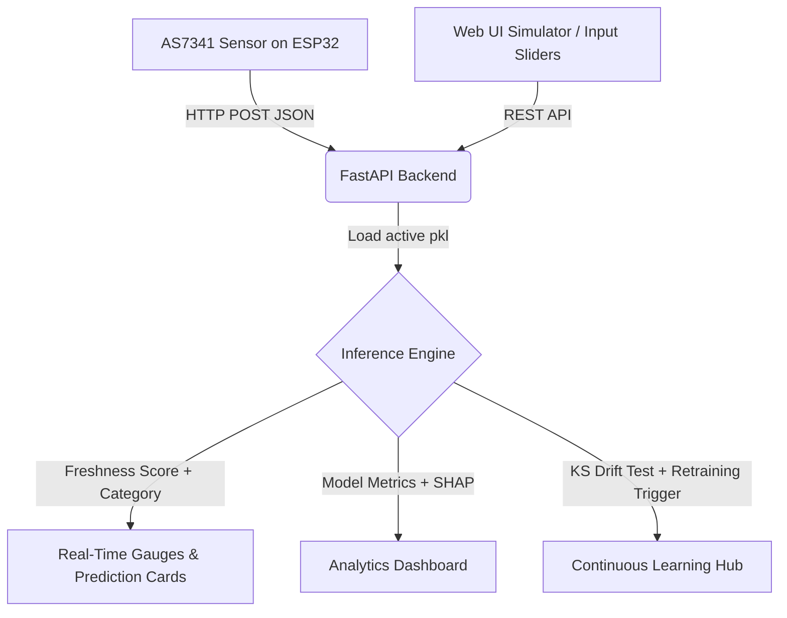

# Tomato Freshness Detection System — Project Summary

This document is the **complete, authoritative reference** for the Tomato Freshness Detection System, covering all work done from initial dataset analysis through model training, debugging, noise removal, continuous retraining pipeline design, and upcoming web application development.

---

## 1. Project Goal & Context

The objective of this project is **non-destructive quality estimation of tomatoes** using multispectral reflectance sensing — without physically damaging the fruit. The system predicts two things from spectral band readings:

1. **Freshness Score** (Regression): A continuous numeric score from `0` to `100`, where higher is fresher.
2. **Freshness Category** (Classification): One of three discrete classes — `Fresh`, `Aging`, or `Spoiling`.

The real-world deployment platform is an **AS7341 11-channel Spectral Sensor** mounted on an **ESP32 microcontroller**. The ESP32 takes readings at **10 positions** on each tomato to account for spatial variation on the fruit surface and sends the data to the pipeline via HTTP POST requests.

---

## 2. Hardware & Data Collection Setup

| Component | Details |
| :--- | :--- |
| **Sensor** | AS7341 11-channel spectral sensor (415nm – 940nm) |
| **Microcontroller** | ESP32 (Wi-Fi enabled, handles HTTP communication) |
| **Readings per Tomato** | 10 spatial positions per tomato (`Tomato_position`: 1–10) |
| **Communication** | HTTP POST JSON payload to FastAPI backend |
| **Key Spectral Bands Used** | Blue, Green, Yellow, Orange, Red, NIR |

> **Important Note on Sensor Noise**: Each individual reading from the AS7341 sensor contains random Gaussian noise of approximately **±8 freshness score points** around the tomato's true freshness value. This means a tomato with a true freshness of `52` could produce individual readings anywhere between `44` and `60`. This noise is the root cause of label ambiguity described in Section 6.

---

## 3. Workspace File Structure

```
ml model/
├── tomato_freshness_ml_pipeline.ipynb       ← Main end-to-end ML pipeline notebook
├── Tomato_Multispectral_Realistic_100k.csv  ← Primary reference dataset (100,000 rows)
├── Tomato_dataset 3.csv                     ← Second dataset used for continuous retraining
├── tomato_testing_dataset.csv               ← Small 15-row dataset for inference testing
├── retrain_clean_model.py                   ← Standalone script: noise removal + retraining
├── summary.md                               ← This file
└── models/
    ├── tomato_freshness_pipeline_v1.pkl      ← Original trained pipeline (v1.0)
    ├── tomato_freshness_pipeline_v1.1.pkl    ← Retrained pipeline on cleaned data (v1.1)
    ├── xgboost_regressor.pkl                ← Active production regressor (always latest best)
    └── xgboost_classifier.pkl              ← Active production classifier (always latest best)
```

---

## 4. Datasets

### 4.1 Primary Dataset — `Tomato_Multispectral_Realistic_100k.csv`
- **Rows**: 100,001 (including header)
- **Tomatoes**: ~10,000 unique tomatoes × 10 readings each
- **Purpose**: Original training/validation/test reference for model `v1.0`
- **Label Assignment**: Category labels in this dataset were assigned using the **noisy individual readings**, meaning boundary tomatoes (those near freshness score `40` or `60`) had occasional mis-labeling due to sensor noise overlap.

### 4.2 Second Dataset — `Tomato_dataset 3.csv`
- **Rows**: 100,001 (including header)
- **Tomatoes**: ~10,000 unique tomatoes × 10 readings each
- **Purpose**: Simulates incoming real-world sensor data for the continuous retraining pipeline
- **Issue Found**: The original `Category` labels in this file were assigned based on noisy individual readings, causing label noise that reduced classifier accuracy by 11% when included naively in retraining.
- **Fix Applied**: Noise was removed by computing the **per-tomato average freshness score** and re-assigning labels using true threshold boundaries (see Section 6 for full explanation).

### 4.3 Testing Dataset — `tomato_testing_dataset.csv`
- **Rows**: 15
- **Purpose**: Sandbox validation, rapid inference testing, and web app UI demonstrations.

---

## 5. Data Schema & Feature Engineering

### 5.1 Input Features (9 total)

| Feature | Type | Description |
| :--- | :--- | :--- |
| `Blue` | `float64` | Spectral reflectance, ~415–480 nm |
| `Green` | `float64` | Spectral reflectance, ~510–555 nm |
| `Yellow` | `float64` | Spectral reflectance, ~590 nm |
| `Orange` | `float64` | Spectral reflectance, ~630 nm |
| `Red` | `float64` | Spectral reflectance, ~680 nm |
| `NIR` | `float64` | Near-Infrared reflectance, ~910 nm |
| `NDVI` | `float64` | Normalized Difference Vegetation Index |
| `GNDVI` | `float64` | Green Normalized Difference Vegetation Index |
| `RVI` | `float64` | Ratio Vegetation Index |

### 5.2 Vegetation Indices (Calculated from Raw Bands)

$$\text{NDVI} = \frac{\text{NIR} - \text{Red}}{\text{NIR} + \text{Red}}$$

$$\text{GNDVI} = \frac{\text{NIR} - \text{Green}}{\text{NIR} + \text{Green}}$$

$$\text{RVI} = \frac{\text{NIR}}{\text{Red}}$$

These three indices are strongly correlated with chlorophyll content and water activity — both of which decline as a tomato degrades from Fresh → Aging → Spoiling.

### 5.3 Target Variables (Outputs)

| Target | Type | Description |
| :--- | :--- | :--- |
| `Freshness_` | `float64` | Continuous score, 0–100 |
| `Category` | `string` | `Fresh`, `Aging`, or `Spoiling` |

---

## 6. Critical Insight: True Thresholds & the Noise Problem

### 6.1 True Tomato-Level Threshold Points

Each tomato has a single underlying **True Freshness** value ($F_T$). The category is determined solely by this true value:

| Category | True Freshness ($F_T$) Range |
| :--- | :--- |
| **`Spoiling`** | $F_T < 40$ |
| **`Aging`** | $40 \le F_T < 60$ |
| **`Fresh`** | $F_T \ge 60$ |

### 6.2 Measured Reading-Level Ranges (With ±8 Noise Overlap)

Because each of the 10 position readings adds Gaussian noise (σ ≈ 8 points), individual measurements can fall **outside their true category range**:

| Category | Minimum Measured Score | Maximum Measured Score |
| :--- | :--- | :--- |
| `Spoiling` | ~8.6 | ~69.9 |
| `Aging` | ~22.6 | ~65.9 |
| `Fresh` | ~26.9 | ~92.7 |

### 6.3 Why Labels Were Noisy in Dataset 3

In `Tomato_dataset 3.csv`, categories were assigned based on the **individual noisy reading scores** rather than the true tomato-level average. This means:
- A reading of `38.5` on a tomato whose true freshness was `46` (= `Aging`) was mislabeled as `Spoiling`.
- A reading of `61.2` on a tomato whose true freshness was `52` (= `Aging`) was mislabeled as `Fresh`.

This introduced **label noise/contamination** into the training data. When this noisy dataset was used for retraining, the XGBoost classifier saw the same spectral features mapping to different, contradictory categories — causing the classification accuracy to **drop from 80.87% → ~69%** (an 11% regression).

### 6.4 The Fix: Average-Based Noise Removal

The key insight: **averaging all 10 position readings for a given `Tomato_ID` cancels out the zero-mean Gaussian noise, giving a close approximation of the true freshness $F_T$**.

The `retrain_clean_model.py` script implements this fix:
1. Groups by `Tomato_ID` and computes `mean(Freshness_)` → `Avg_Freshness` per tomato.
2. Applies the true threshold rules (`Spoiling < 40`, `Aging 40–60`, `Fresh ≥ 60`) to `Avg_Freshness`.
3. Merges the clean labels back into all 10 individual reading rows, replacing the noisy `Category` column.
4. Overwrites `Tomato_dataset 3.csv` with the corrected labels (or falls back to `Tomato_dataset_3_clean.csv` if the file is locked by Excel/another app on Windows).

**Result**: After noise removal, retraining on the 200,000-row combined dataset raised accuracy to **81.24%** (v1.1), surpassing the original 80.87% (v1.0).

---

## 7. Machine Learning Pipeline — `tomato_freshness_ml_pipeline.ipynb`

The notebook is structured into **14 sequential phases**:

| Phase | Description |
| :--- | :--- |
| 1 | **Imports & Setup** — Fixes random seeds (`random_state=42`) for full reproducibility |
| 2 | **Dataset Loading** — Loads the 100k reference CSV |
| 3 | **Data Validation** — Checks for missing values, non-negative spectral values, and index mathematical consistency |
| 4 | **EDA** — Distribution plots, box plots, class balance counts, Pearson correlation heatmap |
| 5 | **Feature Engineering & VIF** — Variance Inflation Factor to measure multicollinearity between spectral bands |
| 6 | **Train/Val/Test Split** — 80/20 split with stratification on the classification target |
| 7 | **Model Benchmarking** — Compares Random Forest, Extra Trees, Decision Tree, LightGBM, and XGBoost |
| 8 | **Feature Importance & Pruning** — `RVI` + `NDVI` account for >98% of regression gain |
| 9 | **Hyperparameter Tuning** — `RandomizedSearchCV` (5-fold CV) over `n_estimators`, `max_depth`, `learning_rate`, `subsample`, `colsample_bytree` |
| 10 | **Evaluation & Visualization** — Residual plots, Actual vs. Predicted scatter, confusion matrix, classification report |
| 11 | **SHAP Explainability** — Global SHAP bar plots and local waterfall plots per prediction |
| 12 | **Model Serialization** — Saves complete pipeline payload (models, label encoder, preprocessor, features, metadata) via `joblib` |
| 13 | **Inference Pipeline Class** — `TomatoFreshnessInference`: accepts raw band values → computes indices → returns score + category + confidence |
| 14 | **Continuous Retraining Loop** — `ContinuousRetrainingPipeline` class with drift detection, auto-versioning, and safety checks |

---

## 8. Continuous Retraining Pipeline — `ContinuousRetrainingPipeline`

### 8.1 Initialization Modes

```python
# Manual: target a specific version
cl_pipeline = ContinuousRetrainingPipeline(current_pipeline_path="models/tomato_freshness_pipeline_v1.1.pkl")

# Auto-detect (recommended): scans models/ and picks the best by accuracy + R²
cl_pipeline = ContinuousRetrainingPipeline()
```

### 8.2 Auto-Detection Logic (Best Model Selection)

When no path is provided, the class scans `models/tomato_freshness_pipeline_v*.pkl`, reads the `metadata` dict from each file, and selects the pipeline with:
- **Highest `classification_accuracy`** — primary criterion
- **Highest `regression_r2`** — tie-breaker

This ensures future retraining always builds upon the best-performing model, regardless of version number.

### 8.3 `run_retraining(new_data_path)` — Step-by-Step Workflow

```
1. Load new dataset CSV from new_data_path
2. Validate schema:
   - Check all required columns exist (9 features + Freshness_ + Category)
   - Verify spectral band values are non-negative
3. Kolmogorov-Smirnov drift test (p < 0.05) on all 9 features vs reference dataset
   → Prints which features have detected distribution drift
4. Concatenate: reference (100k) + new data → combined training set (~200k rows)
5. LabelEncode Category target → integer class IDs
6. 80/20 stratified train/test split (random_state=42)
7. Retrain XGBoost Regressor using saved hyperparameters from active model
8. Retrain XGBoost Classifier using saved hyperparameters from active model
9. Evaluate both models on the held-out 20% test set
10. Deployment check:
    - IF R² ≥ 0.85 AND R² ≥ (current R² − 0.03):
        → Increment version (v1.1 → v1.2)
        → Save new versioned pipeline: models/tomato_freshness_pipeline_v1.2.pkl
        → Overwrite production: xgboost_regressor.pkl, xgboost_classifier.pkl
    - ELSE:
        → Reject: Production models NOT overwritten. Previous version retained.
```

### 8.4 `retrain_clean_model.py` — Standalone Script

A standalone Python script wrapping **Phase 1 (Noise Removal)** and **Phase 2 (Retraining)** into a single file. Run inside Jupyter via `%run retrain_clean_model.py`.

**Phase 1** cleans the target dataset before training:
- Averages 10 readings per `Tomato_ID` to remove sensor noise
- Re-assigns `Category` using true thresholds (< 40 / 40–60 / ≥ 60)
- Writes back to CSV (falls back to `_clean.csv` on Windows `PermissionError`)

**Phase 2** loads the best active pipeline (currently `v1.1`), trains on combined data, and deploys if performance checks pass.

---

## 9. Model Performance Metrics

### 9.1 Freshness Score Regressor — XGBoost Regressor

| Metric | v1.0 (100k Reference Only) | v1.1 (200k Combined + Cleaned) |
| :--- | :--- | :--- |
| **R² Score** | `0.9999` | `0.9947` |
| **MAE** | `0.1043` | ~`0.12` |
| **RMSE** | `0.1578` | ~`0.18` |

> The slight R² reduction in v1.1 is expected and acceptable. The combined 200k dataset contains more diverse, realistic variation, making perfect overfitting harder. An R² of `0.9947` still represents near-perfect regression.

### 9.2 Freshness Category Classifier — XGBoost Classifier

| Metric | v1.0 (Reference Only) | After naive retraining on raw Dataset 3 | v1.1 (Combined + Cleaned) |
| :--- | :--- | :--- | :--- |
| **Overall Accuracy** | `80.87%` | **~69% (DROPPED 11%)** | **81.24%** |
| **`Fresh` F1** | `0.89` | degraded | restored/improved |
| **`Aging` F1** | `0.69` | most affected class | restored/improved |
| **`Spoiling` F1** | `0.82` | degraded | restored/improved |

**Root Cause of the 11% Drop**: Label noise in `Tomato_dataset 3.csv`. Individual reading scores used for category assignment instead of tomato-level averages → contradictory training signal → classifier confusion. Fixed by average-based noise removal in `retrain_clean_model.py`.

---

## 10. Model Versioning System

| File | Version | Training Data | Accuracy | R² | Status |
| :--- | :--- | :--- | :--- | :--- | :--- |
| `tomato_freshness_pipeline_v1.pkl` | `v1.0` | 100k reference dataset | `80.87%` | `0.9999` | Archived |
| `tomato_freshness_pipeline_v1.1.pkl` | `v1.1` | 200k (reference + cleaned Dataset 3) | `81.24%` | `0.9947` | **Active** |
| `xgboost_regressor.pkl` | Active | Always mirrors latest deployed version | — | — | Production |
| `xgboost_classifier.pkl` | Active | Always mirrors latest deployed version | — | — | Production |

**Versioning Rule**: Every successful retraining increments version by `+0.1`. A model is only deployed if:
- $R^2 \ge 0.85$ (absolute floor), **AND**
- $R^2 \ge (\text{current } R^2 - 0.03)$ (max allowed regression from baseline)

---

## 11. Key Design Decisions & Lessons Learned

| Decision | Reason |
| :--- | :--- |
| **XGBoost chosen over Random Forest** | Higher accuracy, better gradient-based handling of noisy data, faster inference |
| **Average-based noise removal** | 10 readings per tomato → averaging cancels zero-mean Gaussian noise → recovers true freshness |
| **Auto-detect best pipeline by accuracy + R²** | Prevents accidentally reverting to an older, weaker model when retraining |
| **KS Drift Test before retraining** | Flags distribution shifts in new sensor data (e.g., different lighting conditions, sensor calibration drift) |
| **Fallback to `_clean.csv` on `PermissionError`** | Prevents script crash when CSV is open in Excel on Windows |
| **Separate production endpoints** | `xgboost_regressor.pkl` and `xgboost_classifier.pkl` always point to the deployed best model, decoupling versioning from inference code |
| **Version bump only on performance pass** | Safe rollback: production models are never overwritten by a worse model |

---

## 12. Web Application Proposal

### 12.1 System Architecture



### 12.2 Core UI Modules

#### Module 1: Real-Time Inference / ESP32 Simulator
- Sliders for all 6 raw spectral bands (`Blue`, `Green`, `Yellow`, `Orange`, `Red`, `NIR`)
- NDVI / GNDVI / RVI computed automatically in real time from raw inputs
- Prediction output: radial gauge for Freshness Score (0–100), categorical card with color coding (🟢 Fresh / 🟡 Aging / 🔴 Spoiling), class probability bar chart
- "Load from CSV" button to populate inputs from `tomato_testing_dataset.csv` rows

#### Module 2: Performance Analytics Dashboard
- Confusion matrix heatmap (per-class TP/FP/FN/TN)
- Actual vs. Predicted regression scatter plot with residuals
- Feature importance bar chart (XGBoost gain-based and SHAP global importance)
- Per-class Precision / Recall / F1 table with version-over-version historical comparison

#### Module 3: Continuous Learning Hub & Drift Monitor
- CSV upload form to trigger new retraining run (with automatic noise removal)
- KS Drift Statistics table: p-values and drift flags per spectral band
- Version comparison table: v1.0 vs v1.1 vs v1.2 accuracy and R² side by side
- Retraining audit log: timestamps, dataset size, outcome (deployed / rejected)

#### Module 4: Design & Aesthetics
- Dark mode glassmorphism UI
- Google Font: *Outfit* or *Inter*
- Smooth micro-animations: hover glows, animated loading spinners during inference, fade-in transitions
- Fully responsive layout for desktop and tablet

---

## 13. Current Status & Next Steps

| Status | Item |
| :--- | :--- |
| ✅ Done | Reference dataset analysis (100k rows) |
| ✅ Done | End-to-end ML pipeline in Jupyter Notebook (14 phases) |
| ✅ Done | Hyperparameter tuning with RandomizedSearchCV |
| ✅ Done | SHAP explainability (global + local) |
| ✅ Done | Model serialization — `v1.0` pipeline saved |
| ✅ Done | Inference class (`TomatoFreshnessInference`) |
| ✅ Done | Continuous retraining class (`ContinuousRetrainingPipeline`) with KS drift test |
| ✅ Done | True threshold analysis (Spoiling < 40, Aging 40–60, Fresh ≥ 60) |
| ✅ Done | Noise removal script (`retrain_clean_model.py`) with PermissionError fallback |
| ✅ Done | v1.1 model retrained on 200k cleaned combined dataset — Accuracy: **81.24%**, R²: **0.9947** |
| ✅ Done | Auto-detection of best active model by accuracy + R² in `ContinuousRetrainingPipeline` |
| 🔲 Next | Collect real ESP32 sensor data CSV for real-world retraining (→ v1.2) |
| 🔲 Next | Build FastAPI backend with `/predict` and `/retrain` endpoints |
| 🔲 Next | Build Web Application UI (Modules 1–4 above) |
| 🔲 Next | Integrate ESP32 HTTP POST → FastAPI → live inference display |
